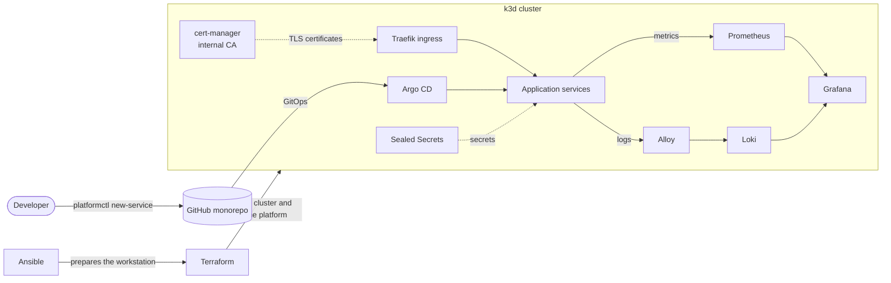

# paved-road

[🇫🇷 Français](README.md) | 🇬🇧 English

**paved-road** is a small internal developer platform (IDP) that runs on a laptop. It mirrors the work of a platform team: a Kubernetes foundation described as code, a self-service *golden path* to create services, observability and certificates built in by default, and secrets managed the GitOps way.

The first service shipped through the golden path is a RAG assistant that answers developer questions from the platform's own documentation.

## Architecture



| Layer | Tools |
|---|---|
| Workstation | Ansible |
| Cluster | k3d (k3s), driven by Terraform |
| Platform foundation | Terraform + Helm, pinned chart versions |
| Delivery | Argo CD (GitOps, app-of-apps) |
| Networking and TLS | Traefik, cert-manager with an internal CA |
| Observability | Prometheus, Grafana, Loki, Alloy |
| Secrets | Sealed Secrets |

Design decisions are recorded in the [ADRs](docs/adr/).

## Quick start

Requirements: macOS with [Homebrew](https://brew.sh) and 16 GB of RAM.

```bash
make bootstrap   # install the toolchain and start Colima (Ansible)
make up          # create the cluster and install the platform (Terraform)
make trust       # trust the internal CA in the macOS keychain (sudo)
make creds       # print the admin passwords
```

| UI | URL |
|---|---|
| Argo CD | https://argocd.localhost |
| Grafana | https://grafana.localhost |

`make down` deletes the cluster and `make help` lists every target.

## Repository layout

```
ansible/          workstation setup
infra/cluster/    k3d cluster (Terraform)
infra/platform/   platform foundation (Terraform + Helm)
docs/adr/         architecture decision records
cli/              platformctl, the golden path CLI (Go)
templates/        service templates
apps/             services deployed by Argo CD
```

## Roadmap

- [x] **Foundation**: Ansible, k3d cluster via Terraform, Argo CD, cert-manager and internal CA, Prometheus/Grafana/Loki, Sealed Secrets
- [ ] **Golden path**: `platformctl` Go CLI, Python and Go templates, GitHub Actions CI, e2e test
- [ ] **RAG assistant**: FastAPI, pgvector, Ollama or API, `platformctl ask`
- [ ] **Polish**: OpenShift portability, Trivy scan, demo video
