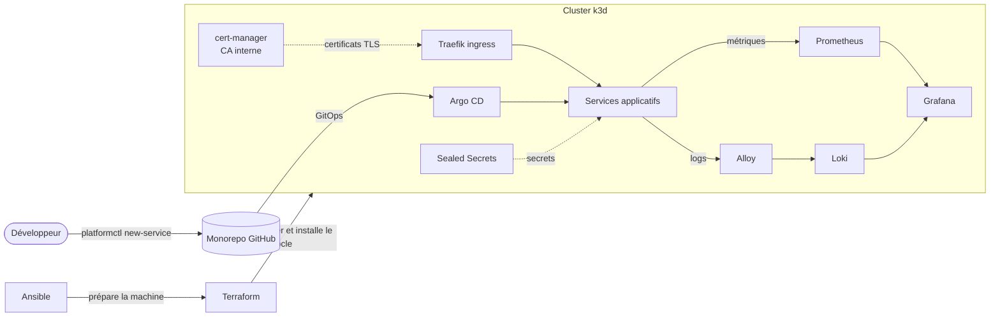

# paved-road

🇫🇷 Français | [🇬🇧 English](README.en.md)

**paved-road** est une mini plateforme de développement interne (IDP) qui tourne sur un laptop. Elle reproduit le travail d'une équipe plateforme : un socle Kubernetes décrit en code, un *golden path* en self-service pour créer des services, de l'observabilité et des certificats intégrés par défaut, et des secrets gérés en GitOps.

Le premier service livré par ce golden path est un assistant RAG qui répond aux questions des développeurs à partir de la documentation de la plateforme.

## Architecture



| Couche | Outils |
|---|---|
| Poste de travail | Ansible |
| Cluster | k3d (k3s), piloté par Terraform |
| Socle plateforme | Terraform + Helm, versions de charts épinglées |
| Déploiement | Argo CD (GitOps, app-of-apps) |
| Réseau et TLS | Traefik, cert-manager avec une CA interne |
| Observabilité | Prometheus, Grafana, Loki, Alloy |
| Secrets | Sealed Secrets, `platformctl seal` |
| Bases de données | CloudNativePG (PostgreSQL 18, pgvector) en self-service |
| IA | Ollama (`qwen3:1.7b`) partagé, ou Claude via API |
| Sécurité de la chaîne | Trivy (configuration, chart rendu, images), images multi-arch amd64/arm64 |

Les choix sont expliqués dans les [ADR](docs/adr/), et les [guides](docs/guides/) décrivent l'usage au quotidien.

## Démarrage rapide

| Système | Prérequis |
|---|---|
| macOS | [Homebrew](https://brew.sh) |
| Debian, Ubuntu | `sudo apt-get install -y make` |
| Windows | [WSL2](https://learn.microsoft.com/fr-fr/windows/wsl/install) avec Ubuntu, puis comme Ubuntu |

```bash
make bootstrap   # installe les outils, démarre Docker, choisit un profil (Ansible)
make up          # crée le cluster et installe la plateforme (Terraform)
make trust       # fait confiance à la CA interne (sudo)
make creds       # affiche les mots de passe admin
```

| Interface | URL |
|---|---|
| Argo CD | https://argocd.localhost |
| Grafana | https://grafana.localhost |

`make down` supprime le cluster, et `make help` liste toutes les commandes.

### Profils de ressources

| | `full` | `lite` |
|---|---|---|
| RAM conseillée | 16 Go | 8 Go |
| Nœuds | 2 | 1 |
| Logs (Loki) et Alertmanager | oui | non |

`make bootstrap` choisit le profil selon la RAM de la machine. Pour le forcer : `make bootstrap PROFILE=lite`. Détails dans l'[ADR 4](docs/adr/0004-resource-profiles-and-supported-systems.md).

## Golden path : créer un service

```bash
make cli                                          # compile bin/platformctl
bin/platformctl new-service orders-api --lang go  # ou --lang python
git add apps/orders-api && git commit -m "Add orders-api" && git push
bin/platformctl status orders-api
```

`new-service` génère le code, les tests, un Dockerfile non-root et un `values.yaml`. Après le merge, la CI construit l'image et la pousse sur GHCR, puis Argo CD déploie le service sur https://orders-api.localhost avec un certificat TLS, des métriques Prometheus et un dashboard Grafana. Tous les services partagent le même chart Helm (`platform/charts/service`), maintenu par l'équipe plateforme. Détails dans l'[ADR 5](docs/adr/0005-gitops-delivery.md).

`bin/platformctl doctor` vérifie l'état de la plateforme, et `make e2e` déroule tout le golden path en local pour chaque langage.

### Capacités en self-service

Un service les active dans son `values.yaml`, sans écrire de manifest Kubernetes :

| Capacité | Clé | Ce que fait la plateforme |
|---|---|---|
| Base PostgreSQL | `postgres.enabled` | l'opérateur crée la base, les identifiants arrivent dans `DATABASE_URL` |
| Jobs après déploiement | `jobs` | migrations, indexation… à chaque déploiement réussi |
| Secrets | `secrets` | valeurs chiffrées par `platformctl seal`, injectées en variables d'environnement |
| Dashboard | `dashboard.panels` | panneaux propres au service ajoutés au dashboard standard |
| LLM partagé | `http://ollama.ai.svc:11434` | serveur de modèles commun (profil `full`) |

Détails dans le guide [platform-capabilities](docs/guides/platform-capabilities.md).

### Accès au dépôt privé

Argo CD et les nœuds du cluster lisent le dépôt et les images avec deux tokens en lecture seule, passés par l'environnement avant `make up` :

```bash
export PAVED_ROAD_GIT_TOKEN=...       # fine-grained : Contents read, ce dépôt uniquement
export PAVED_ROAD_REGISTRY_TOKEN=...  # classic : read:packages uniquement
```

## Assistant de la plateforme

[`rag-assistant`](apps/rag-assistant/) est le premier service créé avec le golden path. Il répond aux questions des développeurs à partir de `docs/`, dans la langue de la question, en citant ses sources :

```bash
bin/platformctl ask "Comment ajouter une base PostgreSQL à mon service ?"
```

C'est un RAG : il utilise des embeddings multilingues dans le service, pgvector sur la base fournie par la plateforme, une indexation par un Job après chaque déploiement et le LLM partagé. La qualité de la recherche est mesurée (recall@4 de 100 % sur 12 questions de référence). Le design et les mesures sont dans l'[ADR 6](docs/adr/0006-rag-assistant.md).

## Structure du dépôt

```
ansible/          préparation du poste de travail (macOS, Debian/Ubuntu)
hack/             scripts utilitaires
infra/cluster/    cluster k3d (Terraform)
infra/platform/   socle plateforme (Terraform + Helm)
docs/adr/         décisions d'architecture
platform/         chart partagé des services, config Argo CD, config.yaml
cli/              platformctl, le CLI du golden path (Go)
templates/        modèles de services (Python, Go)
apps/             services déployés par Argo CD
.github/          CI : lint, tests, build des images, e2e
```

## Feuille de route

- [x] **Socle** : Ansible (macOS, Linux, WSL2), profils full et lite, cluster k3d via Terraform, Argo CD, cert-manager et CA interne, Prometheus/Grafana/Loki, Sealed Secrets
- [x] **Golden path** : CLI `platformctl` en Go, templates Python et Go, CI GitHub Actions, test e2e
- [x] **Assistant RAG** : FastAPI, pgvector, Ollama ou API, `platformctl ask`, évaluation de la recherche
- [x] **Sécurité et portabilité** : scans Trivy en CI, images multi-arch, [portabilité OpenShift](docs/adr/0007-openshift-portability.md)
- [ ] **Démo** : vidéo
